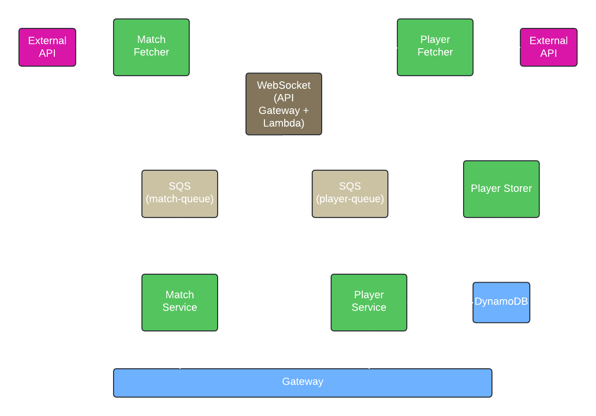

# Euro2024

Euro2024 is a microservice-based application developed in Go that provides real-time match data from an external API. It consists on multiple components that handle data fetching, processing, storage and access to the data. 

# Table of Contents
- [Architecture diagram](#architecture-diagram)
- [Usage](#usage)
  - [Accessing the endpoints](#acessing-the-endpoints)
  - [Example request](#example-request)

## Architecture diagram

## Usage
### Accessing the endpoints
* Once all services are running, you can access the match data through the `gateway` service.
* Endpoints:
    - /api/v1/user/sign-up
    - /api/v1/user/sign-in
    - /api/v1/user/sign-out
    - /api/v1/match/live
    - /api/v1/match/upcoming
    - /api/v1/team/:team/matches
    - /api/v1/team/:team/players
### Example request
```
curl -X GET "http://localhost:8080/api/v1/match/live"
```

